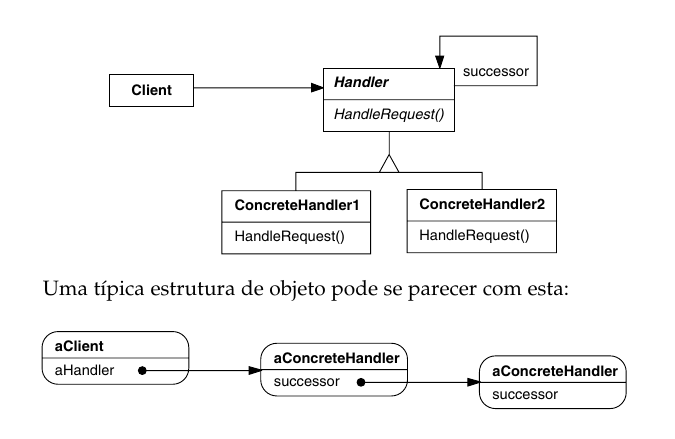
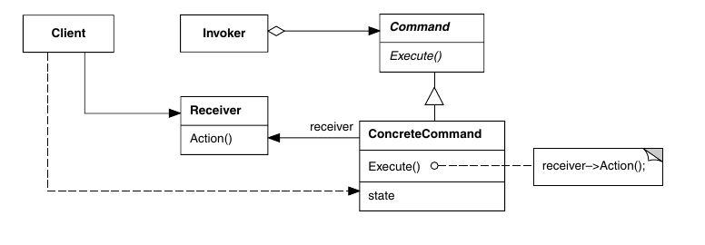

# Resumo - strategy e template methods

O diretório atual contém um resumo a respeito dos padrões command e chain of
responsability.

## Padrões

### Chain of responsability

O padrão chain of responsability atua em casos onde um componente do programa faz
uma solicitação para tratamento de um recurso/interação, e diferentes objetos
podem realizar esse tratamento, a depender de qual é o recurso/interação. O chain
of responsability será adequado quando se há uma configuração dessa forma e há uma
"hierarquia" das objetos que podem tratar a requisição, com objetos que tratam
casos mais específicos e objetos que tratam casos mais gerais.

Participam desse padrão o client, que de alguma forma necessita que o recurso ou
interação sejam tratados, uma interface handler, que define o método
`handleRequest` padronizado para tratar o recurso, e os handlers concretos, que
efetivamente sobreescrevem o método com a forma de tratamento. Eles são reponsáveis
também por avaliar se podem tratar, e caso não possam, precisam passar para
frente a solicitação.

Esse padrão reduz o acoplamento, já que o cliente não precisa saber tratar o
recurso, e adiciona flexibilidade no tratamento, já que é possível acrescentar
ou remover tratadores da cadeia dinamicamente. Mas o cliente precisa estar ciente
de que, a depender da estrutura da cadeia, uma requisição poderá ser não tratada.

Vale observar que é possível reutilizar relações entre classes já usadas para
outras partes do sistema para servirem como "propagadoras" das requisições, mas
esta prática pode ser confusa e não funcionar com as relações já estabelecidas
entre as classes. Quando se cria essas relações e interfaces do zero, é possível
fazer com que a implementação padrão do handler apenas passe a requisição para
frente, e então nas subclasses chamar a implementação da classe mãe para realizar
a passagem da requisição.

O padrão pode ficar complexo quando se é necessário fazer com que os handlers
ajam de forma diferente para diferentes tipos de requisição. É possível definir um
inteiro ou string que agem como flags para determinar o tipo de execução do
handler, o que torna necessário que os programadores estejam cientes dessa
convenção. Outra alternativa é definir uma classe (e classes herdadas dela) que
representa uma solicitação e que pode armazenar os parâmetros envolvidos nas
solicitações.

### Command

O padrão command é usado para desacoplar a execução de ações no sistema das classes
que representam esse sistema. Assim, a classe pode saber que precisa responder a um
imput com a execução de um comando, mas não precisa saber como exatamente executar
esse comando. Esse desacoplamento é poderoso e evita que classes precisem saber
fazer uma operação específica, ao mesmo tempo em que permite que uma operação
seja reutilizada em vários contextos.

O padrão envolve uma interface comando, que define um método para execução. A
partir dele, diversos comandos concretos são criados, efetivamente implementando
o método de execução. Os comandos instanciados são parte de uma relação de
agregação com uma classe que irá usar a interface de execução (invoker), e podem
ser associados a diferentes classes que irão ser manipuladas pelo comando
(receptor). O tempo de vida do invoker não precisa estar relacionado com o tempo
de vida do comando.

É possível ver o padrão comando como uma transposição de `callbacks` (funções
registradas que são chamadas posteriormente por um componente) de programas
imperativos/procedurais para programas orientados à objeto. O padrão torna fácil
criar novos comandos que fazem novas funções e podem ser usados intercambiavelmente
com outros, assim como seria possível escrever mais funções callback.

É importante pensar bem na forma como o commando e o receptor irão se relacionar.
O comando pode ou simplesmente invocar um método do receptor ou apenas acessar
e modificar dados necessários nele, mas usando uma lógica implementada dentro de
si (no extremo desse caso, podem haver comandos sem receptor). É preciso pensar
bem em qual é o melhor lugar para se implementar a ação em si, levando em conta
a complexidade da classe receptor. Em algumas situações, o comando pode inclusive
fazer uma busca por seu receptor em alguma estrutura de dados global.

Uma grande vantagem do padrão é permitir que o sistema tenha "memória" das últimas
ações realizadas. É possível armazenar uma lista com cópias de comandos
utilizados, e com ela inspecionar o histórico de ações, tanto para reaplicá-las em
uma outra execução zerada do sistema ou para revertê-las. Para poder reverter, é
necessário que os comandos tenham um método de desafazer, e que armazenem dentro 
de si potênciais variáveis de estado que podem ter sido perdidas com o comando.

Uma outra possível classe que se adequa no padrão é a macro comando, que nada
mais é que uma coleção ordenada de comandos que podem ser executados em sequência.
Algumas aplicações permitem, inclusive, a criação de diferentes macros pelo usuário
do sistema.

Uma última vantagem do projeto é sua aplicabilidade em sistemas concorrentes: um
sistema que recebe paralelamente diversos comandos (por exemplo um esquema
servidor - clientes) pode definir lógicas para saber como enfileirar e ordenar
comandos recebidos em tempos diferentes, e então executar em ordem correta as
operações.
