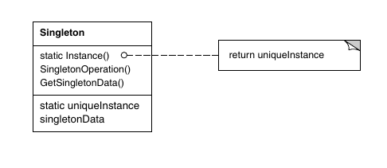
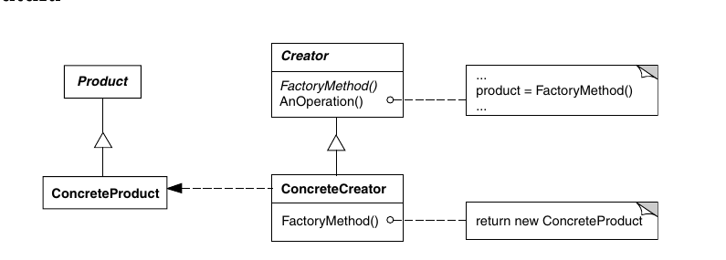

# Atividade - factorys e singleton

O diretório atual contém a resolução da atividade sobre abstract factories,
factory methods e singletons.

## Padrões utilizados na atividade

### Singleton

O singleton é um padrão pensado para casos em que apenas uma instância de uma
classe deve/pode existir na execução da aplicação. Esses casos ocorrem quando
uma classe é uma coleção de várias outras, e apenas uma coleção dessas deve
existir, ou quando a classe tem a responsabilidade de se comunicar com o sistema
e apenas uma instância deve estar fazendo essa comunicação.

O padrão previne que o cliente se preocupe em adminstrar o acesso à instância
durante a execução, já que a própria classe se responsabiliza por sempre retornar
a mesma instância e não permitir a criação de outra, nem que seja por acidente.
Essa característica também permite que o acesso à instância seja alterado na
classe, para por exemplo permitir mais de uma instância, sem precisar de muita
refatoração no código do cliente.

A implementação pode ser feita de várias maneiras. Na mais simples, existirá um
método de classe que vai fazer o gerenciamento da instância. Quando esse método é
chamado pela primeira vez, ele irá criar a instância (lazy loading) e nas
próximas vezes irá retornar a instância já criada (e nesse caso o construtor)
da classe será privado/protegido. Em Python é possível sobreescrever o método
`__new__` ou usar um decorador. 

O singleton fica mais complexo quando envolve subclasses. Caso seja possível
haver uma instância pra cada subclasse, o problema pode ser resolvido com um
mapeamento de classe -> instância da classe que pode ser usado para encontrar
a instância certa. Esse também é conhecido como multiton. Em C++ é possível
implementar o método instance em cada subclasse, mas isso irá forçar o cliente
a saber de quais subclasses ele irá querer fazer a instância de antemão.

### Factory Method

O factory method é um padrão pensado para delegar a criação de uma instância de
uma classe específica para um método, no lugar de diretamente construir essa
classe. Isso é útil para casos em que a interface do construtor é alterada mas
o cliente não precisa saber/se preocupar com isso. Também é útil para caso
existam várias subclasses que possam ser instânciadas, todas seguindo uma
inteface pré-estabelecida, e que a construção delas divirja. Nesse caso, não
é desejado que o cliente se preocupe com essa divergência.

Nesse padrão, existe um Creator, que tem a interface do método factory e 
um Produto, que tem uma interface desejada e posssivelmente várias subclasses
(Produtos Concretos) que implementem ela. 

Uma implementação padrão irá ter várias subclasses do Creator (Creators
Concretos), com cada uma implementando o método factory que cria uma instância
de um produto concreto diferente. O Creator original pode ou não pode implementar
uma factory padrão, tornando opcional ou não a existência de subclasses.

Uma variação do factory method é o factory method parametrizado. Nesse caso,
o método pode receber algum parâmetro e usar ele como base para saber qual
produto concreto ele irá instanciar e retornar. Nesse caso, subclasses do Creator
podem adicionar ou modificar o funcionamento de algumas opções de parâmetro
específicas, e delegar o processamento dos demais parâmetros para o método
da classe pai.

### Abstract Factory

O abstract factory é um padrão pensado para auxiliar na criação de famílias de
produtos que implementem interfaces pré-definidas, tirando do cliente a
preocupação de ter que saber quais as classes concretas dos produtos.

Nesse padrão, existem diversos produtos, que são geralmente abstratos. Esses
produtos abstratos tem subclasses (produtos concretos) que implementam as
interfaces desses produtos, e existem produtos concretos derivados de diferentes
produtos abstratos que tem algo em comum entre si, e devem ser usados em 
conjunto. Por exemplo, podem existir produtos abstratos como componentes de
inteface gráfica (scroll, botão, etc) e implementações desses produtos abstratos
para diferentes bibliotecas de desenho (Qt, GTK).

Para que o cliente não se preocupe com quais produtos concretos instanciar, a
abstract factory define métodos factory abstratos que devem retornar instâncias
específicas dos produtos, e as subclasses da abstract factory vão sobreescrever
esses métodos para retornar produtos concretos específicos e que trabalhem bem
entre si.

As abstract factorys podem ainda ser criadas usando um factory method ou também
podem ser feitas com um singleton para prevenir a existência de várias delas. 

Uma desvantagem clara desse padrão é que ele dificulta a adição de um novo 
produto abstrato, já que todas as factorys existentes teriam que ser modificadas
para adicionar um novo método para esse produto novo. É possível contornar isso
fazendo um método de criação de produtos que receba um parâmetro, no lugar de
vários métodos. Mas isso pode causar inconsistências entre os possíveis
parâmetros que são aceitos por cada factory específica.

## Decisões tomadas na atividade

Para fazer a atividade, tomei a liberdade de mudar a ideia dos elementos de UI
para serem independentes do sistema Mac ou Windows. No lugar, usei a ideia de
diferentes bibliotecas gráficas com diferentes componentes.

Nesse caso, a janela e o cursor são produtos, e suas versões específicas para GTK
ou Qt são produtos concretos. Uma abstract factory define dois métodos, um para
retornar um cursor e um para retornar uma janela, e duas subclasses implementam
eles para o Qt e para o GTK, de forma que um usuário não se preocupa em ele mesmo
garantir que todos os componentes sejam da interface correta.

Essas factorys são criadas por um factory method que está presente na classe da
aplicação, e esse método não faz distinção caso a aplicação seja de Mac ou 
Windows. Esse método é um factory method parametrizado, já que recebe uma string
indicando se a factory retornada deve ser de Qt ou GTK. Seria possível usar
singleton nessas factorys, mas como usei em outra parte da atividade, não usei
aqui pela simplicidade.

Os documentos foram feitos com uma classe abstrata de documento, que define
a interface que eles devem ter, e duas subclasses representando documentos
de cada um dos SO (Mac e Windows). Eles são criados usando um factory method
presente na aplicação. Esse factory method não é parametrizado: existem
subclasses da aplicação para Windows e Mac, e cada uma delas implementa
o facotry method usando a subclasse correta do documento.

A aplicação foi protegida por um singleton, de forma que apenas uma aplicação
pode existir. A forma como implementei isso fugiu um pouco das implementações
vistas normalmente, já que nesse caso só pode exisitr uma aplicação, mas ela
pode ser ou de Mac ou de Windows. Da forma que fiz, o que ocorre é:

1. Quando a classe `Aplicacao` vai ser instanciada, ela verifica uma variável
de ambiente para saber o sistema em uso. Essa ideia foi tirada do GoF.
2. Ela então cria uma instância apropriada de uma aplicação de Windows ou Mac
baseada nessa flag, mesmo que o inicializador seja genérico (`Aplicacao`) ou
de uma subclasse específica (`_AplicacaoWindows` ou `_AplicacaoMac`).
3. Futuras tentativas de instânciar tanto a classe genérica quanto as subclasses
específicas por sistema retornarão a instância existente, mesmo que seja de
outra subclasse.

Esse útlimo comportamento pode ser inconsistente, e as subclasses foram feitas
pensando em *não* serem utilizadas pelo usuário da aplicação, que deve sempre
usar o construtor da classe `Aplicacao` para recuperar a instância desejada.
O cliente então também não se preocupa com instanciar corretamente uma subclasse
de `Aplicacao`, já que essa verificação é feita internamente levando em conta
uma flag. Assim é possível definir operações de Mac e Windows em subclasses
diferentes, sem atrapalhar a interface.

Isso poderia ser feito simplesmente com uma flag armazenada na classe 
`Aplicacao`, que auxiliaria os métodos a saberem qual ação tomar. Mas isso traria
mais responsabilidades para a classe aplicação, que precisaria saber operações
específicas de cada sistema. 
