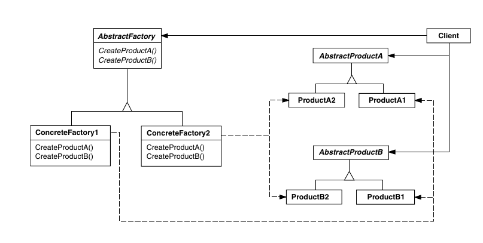

# Abstract Factory

O abstract factory é um padrão pensado para auxiliar na criação de famílias de
produtos que implementem interfaces pré-definidas, tirando do cliente a
preocupação de ter que saber quais as classes concretas dos produtos.

Nesse padrão, existem diversos produtos, que são geralmente abstratos. Esses
produtos abstratos tem subclasses (produtos concretos) que implementam as
interfaces desses produtos, e existem produtos concretos derivados de diferentes
produtos abstratos que tem algo em comum entre si, e devem ser usados em 
conjunto. Por exemplo, podem existir produtos abstratos como componentes de
inteface gráfica (scroll, botão, etc) e implementações desses produtos abstratos
para diferentes bibliotecas de desenho (Qt, GTK).

Para que o cliente não se preocupe com quais produtos concretos instanciar, a
abstract factory define métodos factory abstratos que devem retornar instâncias
específicas dos produtos, e as subclasses da abstract factory vão sobreescrever
esses métodos para retornar produtos concretos específicos e que trabalhem bem
entre si.

As abstract factorys podem ainda ser criadas usando um factory method ou também
podem ser feitas com um singleton para prevenir a existência de várias delas. 

Uma desvantagem clara desse padrão é que ele dificulta a adição de um novo 
produto abstrato, já que todas as factorys existentes teriam que ser modificadas
para adicionar um novo método para esse produto novo. É possível contornar isso
fazendo um método de criação de produtos que receba um parâmetro, no lugar de
vários métodos. Mas isso pode causar inconsistências entre os possíveis
parâmetros que são aceitos por cada factory específica.
