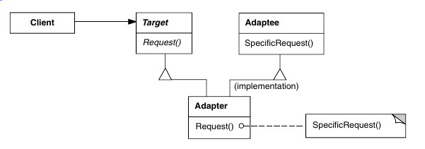
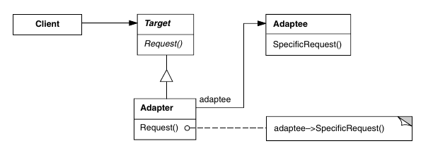

# Adaptador

Os adaptadores são um padrão de projeto pensado para o caso em que se deseja
utilizar uma classe em um projeto, mas essa classe (_adaptee_) não implementa as
interfaces esperadas pelo cliente. Eles cumprem o papel de implementar essas
interfaces, utilizando e manipulando as interfaces do objeto que se deseja
utilizar.

Existem duas ideias para implementar adaptadores: adaptadores de classe e 
adaptadores de objeto.

Os adaptadores de classe funcionam com herança múltipla: eles herdam tanto
de uma classe que implementa a interface desejada quanto da classe original que
se deseja adaptar. Logo, eles fazem tudo o que a classe original faria, com a adição da interface nova.

Os adaptadores de objeto funcionam herdando apenas da classe que implementa a
interface desejada. Por meio de uma composição, eles armazenam uma instância
da classe original (_adaptee_) e então conseguem usar ela e seus métodos para
implementar a interface desejada. Essa aplicação tem a vantagem de poder adaptar
classes que herdam da classe adaptada.

A escolha depende principalmente de dois fatores: se haverão múltiplas subclasses
da classe adaptada e se será necessário alterar métodos e comportamentos internos
da classe adaptada. No primeiro caso, o uso de adaptadores de objeto é melhor e
no segundo caso, o uso de adaptadores de classe é melhor.

Também é possível fazer adaptadores de dois sentidos, que herdarão das duas
classes e oferecerão as interfaces das duas.
