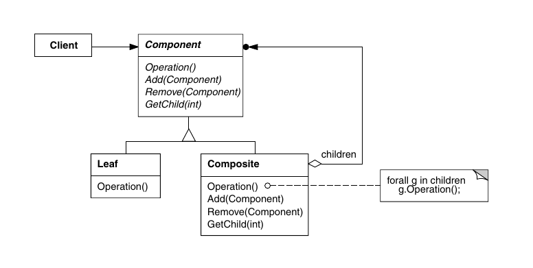

# Composite

O composite é um padrão estrutural empregado em problemas que envolvem
hierarquias de elementos. Mais especificamente, é um padrão útil para cenários
em que um objeto pode tanto funcionar por si só como elemento quanto pode
agrupar outros objetos que funcionam com elementos, e o cliente não quer se
preocupar em fazer essa verificação. Ou seja, é um padrão muito útil para
estruturas de pai-filho, especialmente árvores, já que o cliente poderá
simplesmente usar qualquer nó para executar uma operação, e o nó que saberá se
ele mesmo executará a operação ou se ela vai ser passada para seus filhos.

Para isso, o padrão terá uma classe abstrata `Component`, que tanto classes 
folha quanto classes nó irão herdar. Essa classe abstrata definirá as
interfaces tanto para gerenciar filhos (adicionar, remover, acessar, etc)
quanto para executar operações (como por exemplo desenhar, caso esteja se
trabalhando com uma biblioteca para GUIs).

Esta configuração acaba indo contra o SOLID, já que a classe abstrata irá
definir interfaces de coleção que subclasses representando folhas não precisam.
Uma forma razoável de fornecer uma interface não tão carregada é fornecer
implementações padrão para elas na classe `Component`, com essas implementações
padrão não realizando de fato operações com filhos. Assim, subclasses de 
`Component` que forem de fato coleções irão reimplementá-las, enquanto
subclasses que forem folhas podem usar a implementação padrão.

Nesse caso, o cliente poderá tentar executar operações de coleção em classes
que não a implementam, mas este é um efeito colateral do padrão, que enfatiza
transparência (tornar as classes intercambiáveis entre si) em detrimento da
segurança (saber que nunca chamarão um método de coleção em uma folha).
Geralmente se usa uma flag para saber se a classe é coleção ou não, e erros
são lançados caso o cliente use uma operação onde não deveria. Apesar do
cliente, com isso, precisar de um `if` para verificar a flag, ele não precisará
verificar qual classe um objeto é especificamente.

É uma ideia boa num geral usar referências/ponteiros para nós superiores
na hierarquia, a não ser que o mesmo objeto possa fazer parte de duas coleções
diferentes nessa configuração. É importante que as implementações para deleção,
cache e outras coisas levem em conta a estrutura hierarquica nesse padrão,
para evitar que por exemplo uma coleção deletada não delete seus filhos junto,
evitando vazamentos de memória.

Esse padrão auxilia a adição de novas ferramentas no projeto, já que será
possível fazer uma nova subclasse de `Component` e ela já estará apta a ser
utilizada pelo client. 

Como esse padrão pode violar o SOLID por natureza, é importante que ele seja
usado com sabedoria pelo programador, pesando na balança o quanto é importante
que o cliente não faça distinção entre folha e nó.
