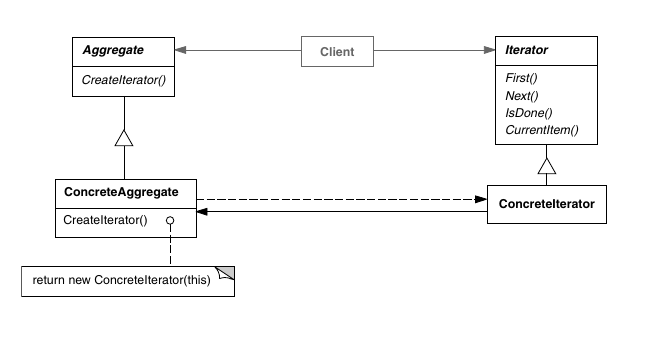

# Iterador

O padrão iterador serve para abstrair de uma coleção (ou agregado) a forma como
ela é percorrida. Ou seja: a implementação da coleção não precisa se preocupar
em como um possível cliente vai percorrer os elementos dela, e nem em armazenar
algum estado de elemento atual ou próximo elemento.

Para isso, se cria uma classe Iterador, que é ligada à coleção por meio de uma
composição. Essa classe vai internamente ter acesso as interfaces da coleção
e por cima delas vai poder implementar uma lógica para percorrer ela. O iterador
geralmente implementa métodos para avançar e voltar na coleção e para obter o 
elemento atual, mas isso depende um pouco da linguagem de programação e de como o
cliente espera iterar.

Algo importante a se destacar é que o iterador fica inválido a partir do momento
em que houver uma alteração na coleção associada a ele. A lógica interna dele
deve levar isso em conta.

Em Python, um objeto iterável (ou seja, que tem uma classe de iterador que pode
percorrê-lo) implementa o método `__iter__`, que retorna uma instância do
iterador. Já o iterador implementa o método `__next__`, que retorna um elemento
da coleção e atualiza a lógica interna para saber qual o próximo. É esse método
`__next__` que deve realizar a verificação do estado da coleção, para saber
se é a mesma.

Se algum algorítmo para percorrer a coleção seja implementada nela mesmo e um 
iterador apenas manter o estado da percorrência, esse iterador pode ser chamado
de cursor.

