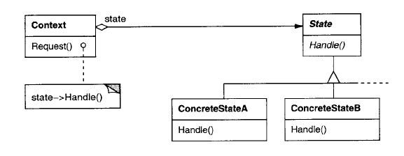

# State

O state é um padrão comportamental usado em situações onde uma classe
`Context` tem diversos métodos e um estado interno, que rege como cada método
deve agir. 

No lugar de ter um grande `if` ou `switch case` em cada método para verificar
o estado do objeto para saber o que fazer, o padrão state define que existirá
uma classe abstrata `State` que terá os mesmos métodos da classe `Context`.
Cada classe que herdar de `State` representará um estado possível e
implementará cada método com o comportamento adequado para aquele estado.

Com isso, a classe `Context` apenas manterá uma referência para o objeto que
representa seu estado atual, e irá encaminhar qualquer chamada de método para
a implementação do estado. Assim, acrescentar novos estados irá requerir que
o programador faça uma nova subclasse de `State`, no lugar de mudar diversas 
cláusulas `if`/`switch case` e adicionar novas instruções em uma mesma função.

Cada método dos estados também receberá uma referência à instância da classe
`Context` que está chamando eles, para que variáveis de contexto possam ser
utilziadas e alteradas sem que elas estejam no objeto que representa o estado. 
Fazendo isso, o objeto que representa o estado poderá ser compartilhado entre
vários objetos que precisam dele, no lugar de haver várias instâncias de um
mesmo estado, uma para cada objeto. Com isso, cada estado pode ser implementado
como um [singleton](./singleton.md). 

A troca de estados é feita trocando apenas a variável que o objeto `context`
mantém como referêncai a seu estado. Isso pode ser feito pelos próprios métodos
dos objetos estado, que terão acesso ao objeto `context` como argumento dos
métodos. Isso acaba protegendo o objeto de ter um estado inválido, já que
uma única operação (trocar uma variável) é o que causa a mudança de estados,
no lugar de alterar várias variáveis.
