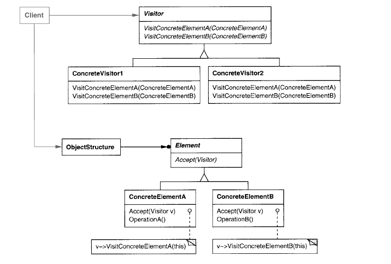

# Visitor

Visitor é um padrão comportamental aplicado em situações em que existe uma
estrutura de objetos e vários algorítmos que devem ser implementados sobre os
elementos dessa estrutura. A ideia é separar a estrutura e suas classes e
hierarquias da execução dos algorítmos, que serão concentradas nas classes
visitor.

No lugar de cada classe que é parte da estrutura implementar métodos
específicos, cada um para execução de um algorítmo, as classes apenas
implementarão um método `accept`, que irá receber um `Visitor`. O visitor, por
sua vez, irá implementar métodos para interagir com cada tipo de classe da
estrutura, e dentro desses métodos é que a lógica do algorítmo estará
localizada. Assim, a adição de novos algorítmos irá ser feita por meio da
criação de novas classes `Visitor`, e não de novos métodos nas classes da
estrutura.

Mais especificamente, `Visitor` será uma classe abstrata, que definirá métodos
`visit` para cada classe que pode existir na estrutura do problema. Esses
métodos deverão receber uma instância da sua classe correspondente e realizar
uma operação com base nela, podendo acessar seus atributos ou mudar seu estado
para auxiliar nessa operação. Cada classe filha de `Visitor` representará um
algorítmo e saberá o que fazer em cada operação `visit`. Todas as classes da
estrutura deverão implementar o método `accept`, cuja única função (a
princípio) será a de chamar o método `visit` apropriado para seu tipo.

Vale notar, então, que o padrão funciona melhor para casos em que as classes
envolvidas na estrutura não costumam mudar, já que a adição de uma nova classe
requer a alteração de todos os visitor existentes. O padrão favorece a adição
de algorítmos, já que as modificações ficarão concentradas em adicionar uma
nova subclasse para `Visitor`. Cada subclasse de visitor poderá armazenar
informações de estado do algorítmo, que serão utilizadas e modificadas a cada
visita.

O padrão não estabelece uma preferência de como deverá ser feito o uso dos
visitors em todos os elementos. Existem implementações em que o método `accept`
de uma classe composite poderá chamar `accept` de seus filhos com o visitor
antes ou depois de usar a operação `visit` em si mesma. Assim, o algorítmo
será executado por inteiro partindo de uma única chamda `accept` na raiz da
hierarquia.

Outras implementações podem fazer com que a chamada de `accept` em nós filhos
de uma classe seja feita durante a chamada `visit` do visitor naquela classe.
Isso é útil para algorítmos que definem dinamicamente qual será o próximo
elemento visitado de acordo com o estado atual. Uma última abordagem pode
envolver um iterador externo, que irá escolher a forma com que a estrutura
será iterada e então chamará `accept` na ordem que preferir. 

Escolher a melhor forma depende do tipo do problema envolvido, mas é importante
que tanto as classes da estrutura quanto o visitor estejam cientes de qual a
forma escolhida, para evitar que por exemplo tanto `visit` de uma composite
quanto `accept` chamem `accept` nos filhos dela.
