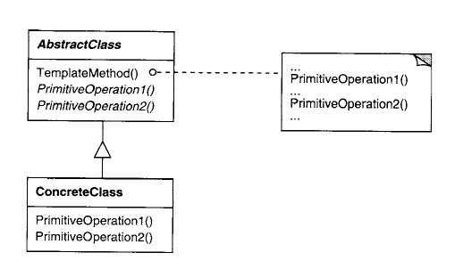

# Resumo - strategy e template methods

O diretório atual contém um resumo a respeito dos padrões strategy e template
methods.

## Padrões

### Strategy

O strategy é um padrão comportamental útil em situações em que se há múltiplos
algorítmos disponíveis para resolver um problema, e se deseja ter uma forma de
escolher entre quais serão usados. A primeira vista, uma simples condicional que
leva em conta uma flag pode parecer suficiente, mas isso aumenta o acoplamento e
as responsabilidades de uma função/classe.

A ideia do strategy é simples: se define uma interface, que é comum à todos os
algorítmos. Diversas subclasses então irão, usando essa interface, implementar os
algorítmos para resolver o problema, cada uma com um algorítmo diferente. Dessa
forma, o cliente poderá se associar à uma instância de qualquer objeto que
implemente essa interface, e poderá chamá-la quando necessário, sem se preocupar
com como o objeto executa o algorítmo.

No esquema acima, o Context pode ser entendido como o cliente da estratégia. É
importante notar que o objeto Strategy e os ConcreteStrategy se responsabilizam
apenas pelo algorítmo, e não por outras partes do código. Fazer o context ter
subclasses que implementassem cada algorítmo seria uma má escolha nesse contexto,
já que o Context se tornaria mais difícil de compreender.

Vale notar também que, a depender do tipo de algorítmo utilizado, pode acontecer
da interface `execute` receber muitos parâmetros, sendo que diferentes estratégias
concretas utilizariam apenas um subconjunto diferente desses parâmetros. Isso pode
ser prejudicial para a execução do código e tornar a interface do `execute` mais
complicada do que o necessário. Uma forma de contornar isso é fazer com que o
`execute` receba uma própria referência pro contexto, e implementar métodos no
contexto para fornecer os dados necessários para o algorítmo. Saber qual escolha
é melhor depende do problema e aplicação em específico.

Por último, vale notar que o responsável do programa por escolher a estratégia
precisa estar ciente das possibilidades. É possível fazer com que o context
realize um comportamento padrão caso não esteja associado a alguma estratégia,
assim deixando o conhecimento delas opcional. Também é importante ter parcimônia:
se no momento não existe a necessidade de haver mais de um algorítmo, introduzir
o padrão strategy pode ser um desperdício de tempo.

### Template methods

De certa maneira, os template methods podem ser comparados com o strategy. Aqui,
existe um algorítmo implementado que tem passos fixos/partes invariantes e partes
que podem variar, e se deseja assegurar que as partes invariantes sempre serão
respeitadas. Se define então uma classe que terá diversos métodos resresentando
os passos variáveis (operações primitivas) e um método template, que irá
orquestrar a execução desses passos.

Ou seja, a classe terá um método template concreto e diversos métodos abstratos,
que representam passos opcionais e obrigatórios do algorítmo geral que a classe
executa. É importante tentar sempre manter o número de operações primitivas deve
ser mantido baixo, para evitar que o uso do projeto seja difícil ou "tedioso".

As operações primitivas usadas pelos métodos template (e que são sobreescritas)
podem ser tanto **obrigatórias** quanto **opcionais**. As opcionais são chamadas
de ganchos/hooks, e geralmente antecedem e precedem alguma operação importante.
As operações obrigatórias são definidas como uma interface, e os ganchos podem ser
definidos como métodos que por omissão não irão executar nada. É importante 
que quem for implementar as operações saiba quais são opcionais e quais não são.

Os benefícios são semelhantes ao strategy: aplicando esse padrão de projeto,
as responsabilidades de uma função diminuirão e o programa será mais fácilmente
extendido no futuro, já que será fácil alterar passos de um algorítmo sem copiar
os passos invariantes.

